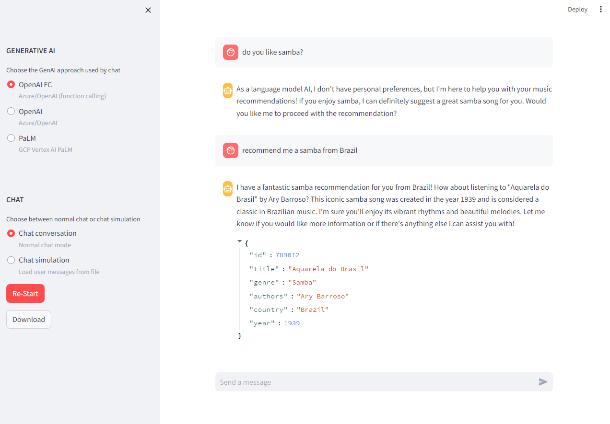

# GenAI Music Chat

This is a simple pilot Python project that describes the use of AI in real chat systems, with the use case being music recommendations. 
The purpose of this project is to serve as an example for a kickstart for those entering the field of Generative AI (GenAI). 
To use this app, you can opt for large language models (LLM) provided by GenAI services such as [OpenAI](https://openai.com/), [Azure OpenAI](https://azure.microsoft.com/en-us/products/ai-services/openai-service/), and/or [GCP Vertex AI PaLM](https://cloud.google.com/vertex-ai).

Generative artificial intelligence, while capable of creating original content, faces limitations in the predictability and coherence of its results. 
Additionally, its understanding of human context may be incomplete, leading to distorted interpretations in some tasks.
These limitations are often reported by providers themselves, such as [OpenAI](https://openai.com/blog/chatgpt) (search for _"Limitations"_) and [PaLM](https://cloud.google.com/vertex-ai/docs/generative-ai/learn/responsible-ai#limitations).


## 1. System Requirements

Before starting to use this app, you must obtain access credentials for the following GenAI services, according to your needs: [OpenAI](https://platform.openai.com/account/api-keys), [Azure OpenAI](https://learn.microsoft.com/en-us/azure/ai-services/openai/reference), and/or [GCP Vertex AI PaLM](https://cloud.google.com/vertex-ai/docs/workbench/reference/authentication#client-libs). 
After cloning this repository to your PC, you should edit the YAML file `assets/settings.yml`, adding your credentials for the GenAI services in the `openai` and `palm` file entries.
Following the minimum system requirements to execute this app:

- **Processor:** 1 Core, x32
- **Memory:** 1 GB RAM
- **Storage:** 50 MB free space
- **OS:** Windows, Linux, macOS

Before using this app, you must install the app requirements by executing the following commands.
Please note that you will need to have [Python 3.9+](https://www.python.org/) and the [virtual environment tool](https://docs.python.org/3/library/venv.html) installed on your PC.


#### Linux

```console
user@host:~$ cd genai_music_chat/
user@host:~$ python3 -m venv venv
user@host:~$ source venv/bin/activate
(venv) user@host:~$ pip install -U pip setuptools wheel
(venv) user@host:~$ pip install -r requirements.txt
```

#### Windows

```console
user@host:~$ cd genai_music_chat/
user@host:~$ python -m venv venv
user@host:~$ venv\Scripts\activate
(venv) user@host:~$ pip install -U pip setuptools wheel
(venv) user@host:~$ pip install -r requirements.txt
```


## 2. App Usage

To use this app with Streamlit, you should execute the following command in your bash.
A new tab/window should open in your browser, and if everything went well, you will be able to interact with the app GUI, as illustrated in the following image. 
You can also use this app to compare the different GenAI services supported by simply executing the `run.py` script and interacting with the chats via the command line.

```console
(venv) user@host:~$ streamlit run streamlit_app.py
```




## 3. Code Documentation

To update the documentation for this project, you can use the [pdoc3](https://pdoc3.github.io/pdoc/) package. 
Run the following command to automatically generate the documentation for `genai_chat` module.
To view the documentation, open the `docs/genai_chat/index.html` file in your browser.
This operation will overwrite the current files in the `docs/` directory.

```console
(venv) user@host:~$ pdoc3 --html --output-dir docs\ genai_chat\ --force --config "lunr_search={'fuzziness': 1, 'index_docstrings': True}" --config "sort_identifiers=False" --config "list_class_variables_in_index=True"
```
